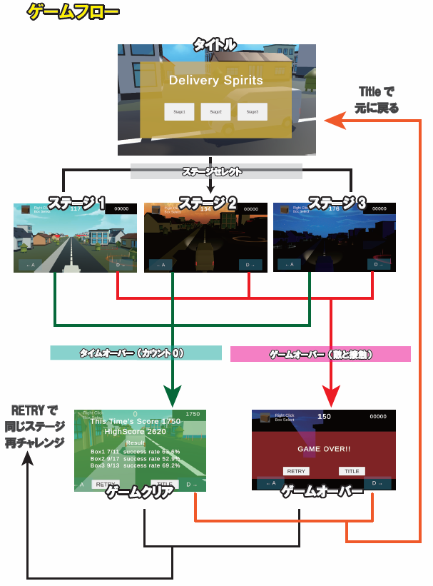
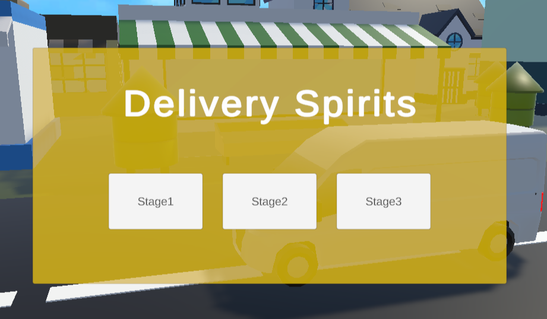
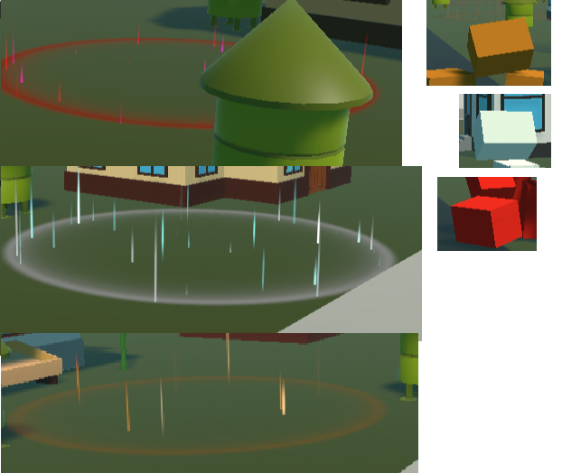
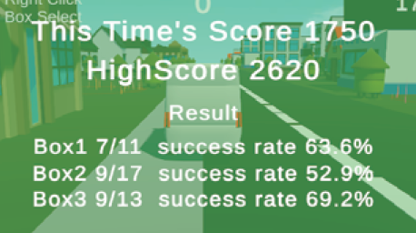

# Delivery Spirits


自動で前に進むトラックから、指定された場所に荷物を届けるゲーム。
シンプルな操作でたくさんの荷物を的確に届けてたくさんポイントをGETしましょう！
油断していると接近してくる対向車とぶつかってゲームオーバーになるかも、安全運転を心がけてたくさんの住民を幸せにしましょう！

## 使用したツールなど
* Unity (ver.2022.3.62f1)
* VisualStudio
* 利用したアセット
1. Low Poly city vehicle pack Lite
2. Pandazole(City Town LowPoly Pack)
3. Area of Effect Spell FREE
4. Fantasy Skybox FREE - Release Notes -
* Illustrator

(Unityバージョンについて)
Unity6では古いアセットが使えないリスクがあったのと、CinemaShineの操作方法が大きく変更されているため、開発効率を上げるために旧来の中でも当時一番最新であったバージョンを採用しました。

(Skyboxの種類)
ゲームが重くなりすぎないように、比較的軽くて見た目が良い物をチョイスしました。背景はステージごとに変えて飽きを少なくするように工夫しています。

(Illustrator)
細かいイラストはフリー素材の他、Illustratorを使って自作して補いました。

## 制作にあたって
Unityの3Dゲームの技術を高める練習として、総合的な内容の復習ができるゲームを考案しました。  
* マウス操作と連動したカメラ視点
* カメラの角度を計算して宅配物が飛んでいく
* UIとカメラ視点の連動
* 宅配物を投函する時の細かな物理挙動
* エフェクトを活用してのゴールエリアの設置
* ハイスコアを塗り替えるために何度も挑戦したくなるような仕組み

など、総合的な技術を盛り込みやすく、また気軽に何回でもゲームができることで親しみやすさを出してみました。
ひとつひとつはシンプルなつくりになっているので開発も効率的に行う事ができました。

## ゲーム企画
  
  


## 作品のポイント
### CinemaShineの活用

CinemaShineコンポーネントを使って、タイトル時やステージクリア時にダイナミックなカメラワークに切り替わるようにしています。

### SkyboxやLightingの調整

ステージごとにSkyBoxやLightingの調整を行って雰囲気をガラッと変えることで飽きを防いでいます

### 3つの宅配物と3つのゴールを用意

エフェクトを使ったゴールのエリアを用意して、宅配物を投函する際、単純すぎて面白みがないといけないので、ゴールの色にあわせた宅配物に切り替えて投函するなど、ユーザーに忙しさを提供してゲームの面白さを底上げするよう工夫しています

Shooter.csの抜粋
```C#
public GameObject[] boxPrefabs; //宅配物のプレハブを格納

//生成対象のBoxの切り替え
if (Input.GetMouseButtonDown(1))
{
    boxNum++;
    if (boxPrefabs.Length == boxNum) boxNum = 0;
}
```

Post.csの抜粋
```C#
private void OnTriggerEnter(Collider other)
{
    if (!posted)
    {
        switch (type)
        {
            case PostType.box1:
                if (other.gameObject.CompareTag("Box1"))
                    //宅配完了の処理
                    PostComp();
                    break;
            case PostType.box2:
                if (other.gameObject.CompareTag("Box2"))
                    //宅配完了の処理
                    PostComp();
                    break;
            case PostType.box3:
                if (other.gameObject.CompareTag("Box3"))
                    //宅配完了の処理
                    PostComp();
                    break;
        }                        
    }
}
```

### 宅配成功率の計算

荷物を投函する際、ゴールに投函が成功した際にそれぞれを色別にカウントしておいて、ゲームクリア時のUIに成功率を出す事によって、ハイスコア以外にもやりこみ要素を提供してシンプルながらスルメゲームとして楽しんでもらえるよう工夫しました。

```C#
//ハイスコアの更新
                if (GameController.stagePoints > highScore)
                {
                    highScore = GameController.stagePoints;
                    PlayerPrefs.SetInt(currentStageName, highScore);                    
               }
//各スコアの表示
                thisTimesScoreText.text = "This Time's Score " + currentPoint.ToString(); //ハイスコアの表示

                highScoreText.text = "HighScore " + highScore; //ハイスコアの表示
//3つのBoxの成功率を表示
                for(int i =0; i < resultNames.Length; i++)
                {
                    float successRate;
                    if (Shooter.shootCounts[i] == 0) successRate = 0;
                    else
                    {
                        //Boxの計算 ※少なくとも片方はfloatにキャスト
                        successRate = ((float)Post.successCounts[i] / Shooter.shootCounts[i]) * 100f;
                    }
                    boxText[i].text = resultNames[i] + " " + Post.successCounts[i] + "/" + Shooter.shootCounts[i] + "  success rate " + successRate.ToString("F1") + "%";
                }
                GameController.gameState = GameState.timeover;
                //リザルトパネルの表示
                resultPanel.SetActive(true);
                //カーソルロックモードの解除
                Cursor.lockState = CursorLockMode.None;
                Cursor.visible = true;
```

などたくさんの工夫をこらして制作しています。

## 今後の制作
* 荷物の着地のしかたで荷物の破損率を出す
* 限られた在庫から在庫切れをおこさないように投函する
* 走るスピードを自分でコントロールできるようにして、時間制限内に配り切る
* アニメーションをさせる事で臨場感を増やす

などまだまだ試したいギミックがあるので、時間をみて改造したいと思います。
